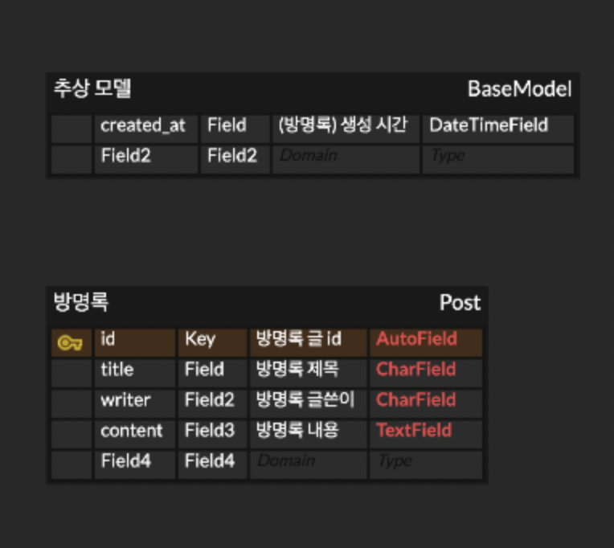

# 방명록 만들기 토이 프로젝트

### API spec

[API](https://www.notion.so/0d1d536a278f4183bc2fa44c75b7472f)

### 연결 도메인

[Domain Address](http://bangmyeonglock.kro.kr:8000/posts/)

### ERD 모델

- ERD 설명
    - Post라는 이름으로 되어 있는 방명록 객체를 메인으로 보시면 될 것 같습니다. 상단에 있는 BaseMode(추상 모델)에서 created_at을 상속 받고 있습니다.
    - 결국, 방명록 객체 안에 id, title, writer, content 값(필드)이 들어갑니다! 이때 id가 Primary Key 역할을 하여 방명록의 고유 번호가 됩니다. (그럼 id는 중복될 일이 없으니 삭제나 조회를 할 때 사용하게 됩니다.)
    - 위의 필드 타입에 대한 설명입니다.
        - **`AutoField`**: 정수형 필드로, Django에서 자동으로 값을 생성하여 Primary Key로 사용합니다.
        
        → 따라서 id는 사용자가 따로 입력하지 않아도 자동으로 들어갑니다. (이전 방명록의 id가 3이었다면 사용자의 방명록 id는 4가 됩니다.)
        
        - **`CharField`**: 문자열 필드로, 최대 길이를 설정할 수 있습니다.
        - **`TextField`**: 긴 문자열을 저장할 수 있는 필드입니다. content는 내용이 길 수 있어 TextField 타입을 사용했습니다.
        - **`DateTimeField`**: 날짜와 시간을 모두 저장할 수 있는 필드입니다.
        - **위의 API spec 처럼 body에는 title, writer, content, 이렇게 3개 값을 넣어줍니다.**
